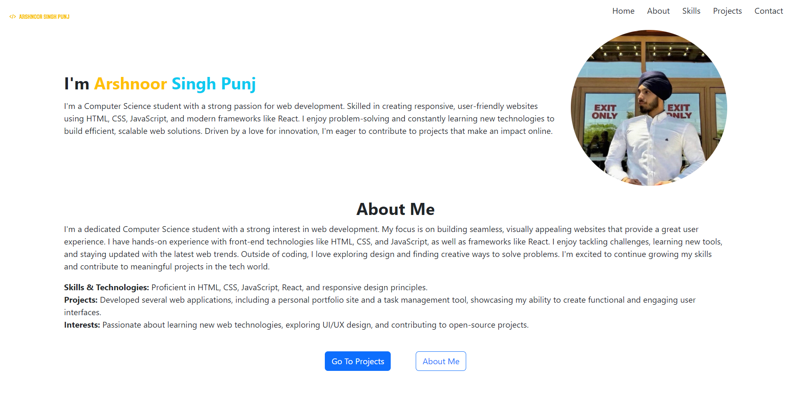

# Developer Portfolio

This is a personal portfolio website showcasing my projects, skills, and professional background. The project uses modern web development technologies, and it is designed to be responsive, interactive, and user-friendly across all devices.

## Tech Stack

### Frontend Technologies:
- **HTML5**: Structure and layout of the pages.
- **CSS3**: Styling and responsive design using flexbox and grid.
- **Bootstrap 5.2.3**: For additional responsiveness and utility classes.
- **JavaScript (jQuery)**: For page interactivity, including SPA (Single Page Application) behavior.
- **AJAX**: Used for loading different sections dynamically without reloading the page.

### Additional Features:
- **Responsive Navbar**: The navbar toggles on mobile view with a smooth height-increasing transition using jQuery.
- **Single Page Application (SPA)**: Pages are loaded dynamically using jQuery and AJAX, making the navigation seamless without full page reloads.

### Assets:
- **Images**: Logos, project screenshots, and profile images are included in the `img` folder.
- **Custom CSS**: Additional custom styles are applied via `style.css` to match the desired theme.

## Project Structure

- `index.html`: The main page and entry point of the portfolio.
- `header.html`, `footer.html`: Components included in all pages for a consistent look.
- `home.html`: The landing section featuring an introduction and a brief overview.
- `about.html`: A detailed description of personal background, professional experiences, and goals.
- `skills.html`: A list of technical and soft skills, showcased using modern web elements.
- `projects.html`: A gallery of notable projects with descriptions, images, and links to the relevant code or live sites.
- `contact.html`: A contact form with relevant social links and details.
- `css/style.css`: The main stylesheet used to customize and enhance Bootstrap styles.
- `js/main.js`: Contains the JavaScript logic for dynamic page loading and interactions.

## How It Works

- **Dynamic Content Loading**: 
  The site is structured as a single-page application (SPA), where each page section (home, about, projects, skills, contact) is dynamically loaded using jQuery's AJAX functions.
  
  ```js
  function loadPage(pageUrl) {
      $.ajax({
          url: pageUrl,
          method: "GET",
          success: function(data) {
              $('.app-container').html(data);
          },
          error: function() {
              $('.app-container').html('<p>Error loading the page. Please try again later.</p>');
          }
      });
  }
  ```

- **Responsive Navigation**: 
  The navigation bar is responsive and collapses into a toggler for mobile devices. Using jQuery, the height is smoothly animated to enhance user experience.
  
  ```js
  $('.navbar-toggler').on('click', function() {
      $('#navbarSupportedContent').toggle('slow');
  });
  ```

## View it live here: [https://arshnoor-singh-punj.onrender.com/](https://arshnoor-singh-punj.onrender.com/)

## Screenshots

### Desktop View:


### Mobile View:


## Contact

Feel free to reach out via the [Contact Section](https://arshnoor-singh-punj.onrender.com/index.html#contact) of the portfolio or through the email:
- **Email**: singharshnoor72@gmail.com
